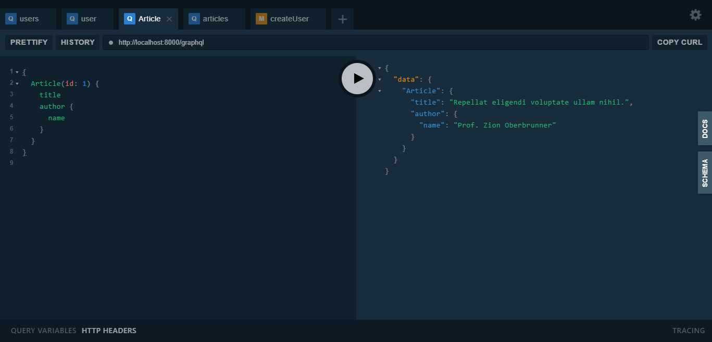

## Laravel and graphql (lighthouse)

after cloning the project and install dependencies and running your migrations

run database seeders to get some data on database

`php artisan db:seed`

then run the server

run `php artisan serve`

and go this link `http://localhost:8000/graphql-playground`

you'll see the screen

you can play with using this

`query users { users { paginatorInfo { total currentPage hasMorePages } data { name email } } }`
